# VitalShield AI

[](https://flutter.dev)
[](https://fastapi.tiangolo.com)
[](https://scikit-learn.org)
[](#)
[](https://github.com/)

VitalShield AI is a wellness monitoring, prediction, analytics, and AI-assistance platform. The application captures daily health vitals, computes predictive wellness scores using machine learning, applies clinical safety safeguards, and provides health coaching using an AI assistant.

---

## Highlights

* **Flutter Web and Android Support**: Cross-platform client architecture supporting mobile and web deployment from a single codebase.
* **FastAPI Backend**: Powered by a Python FastAPI backend for serving predictions, analytics, and assistant services.
* **Offline-First Architecture**: Runs client-side Dart prediction logic when backend connectivity fails, ensuring continuous core functionality.
* **AI Wellness Assistant**: Uses structured context construction to provide automated wellness coaching, falling back to a rule-based dialogue engine offline.
* **Multi-Profile Support**: Supports on-device profile switching with isolated database namespaces and local storage partitions.
* **Clinical Safety Overrides**: Employs deterministic physiological override thresholds to safeguard ML prediction models against out-of-distribution vitals.
* **Prediction Synchronization Engine**: Buffers offline predictions locally and synchronizes them with the backend when connection is restored.
* **85+ Automated Tests**: Validated by a test suite covering widget interaction, integration sync flows, and backend service logic.

---

## Problem Statement

Standard wellness monitoring applications face several critical technical challenges:
1. **Offline Operation**: Many health-tracking platforms rely entirely on continuous internet connectivity, failing to provide predictions or coaching when network access is lost.
2. **Safety-Aware Prediction Handling**: Standard machine learning models (such as Random Forests) cannot extrapolate safety ceilings for extreme, out-of-distribution vital signs, potentially outputting high wellness scores during critical physiological crises.
3. **Actionable Recommendations**: Health insights are often generic or unprioritized, failing to give clear, context-specific guidance based on the user's metrics.
4. **Insight Consistency**: Replicating complex logical scoring and coaching feedback across client (Dart) and backend (Python) layers often leads to logic divergence and conflicting user guidance.

**VitalShield AI addresses these challenges** with a hybrid architecture combining an offline-first prediction engine, clinical safety overrides, and a centralized insight builder protocol that ensures consistent, safety-aware, and actionable health guidance across platforms.

---

## Key Features

* **Offline-First Support**: Runs an identical local prediction engine in Dart when backend connectivity fails, caching offline check-ins and synchronizing them once connectivity is restored.
* **Dual-Model Machine Learning Pipeline**: Utilizes a Random Forest Regressor to calculate the overall wellness score and a Random Forest Classifier to identify the primary wellness domain requiring attention.
* **Clinical Safety Overrides**: Enforces hard ceiling caps (Wellness Score $\le 40$) and triggers critical alerts during emergency physiological conditions (e.g., SBP $\ge 180$, DBP $\ge 120$, Glucose $< 55$ or $> 300$ mg/dL).
* **Centralized Insight Generation**: Establishes a single logical source of truth (implemented in both Python and Dart) that enforces physiology-focused actionable wording templates and computes quantitative `scoreImprovementEstimate` impact metrics.
* **AI Wellness Assistant**: Provides interactive wellness coaching by evaluating the user's latest health snapshots. If offline, the client falls back to a rule-based deterministic response tree.
* **Step Consistency Analysis**: Computes daily activity consistency using the Coefficient of Variation ($CV = \sigma / \mu$), capping inputs at 5,000 steps to ensure the metric evaluates regular movement habits without penalizing high-intensity workouts.
* **Multi-Profile Management**: Supports profile switching with isolated database namespaces and local storage partitions for separate users.

---
 
 
 ## Screenshots

### Login
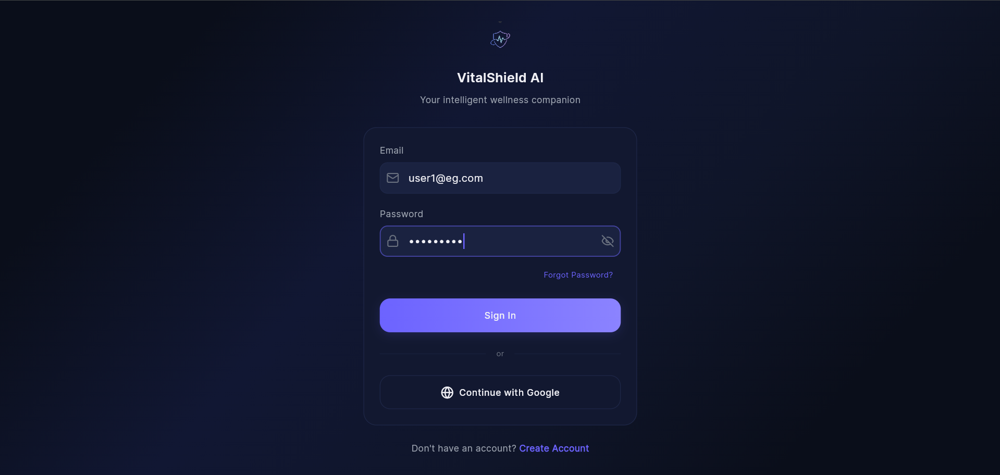

### Sign Up
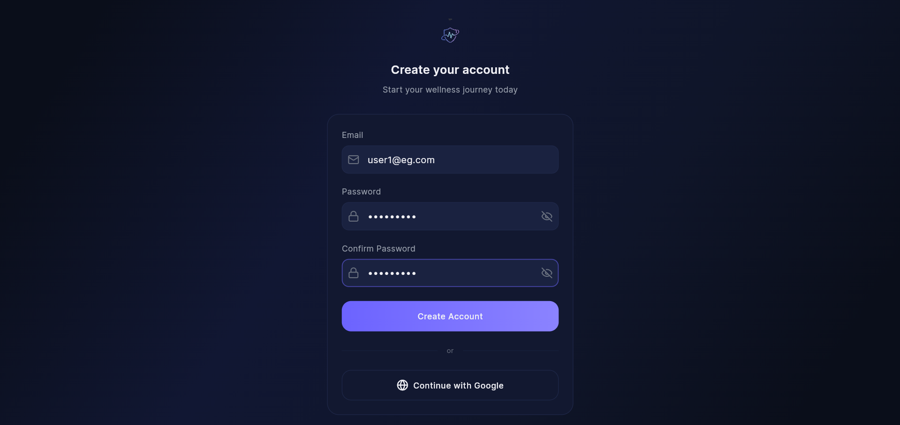

### Profile Setup
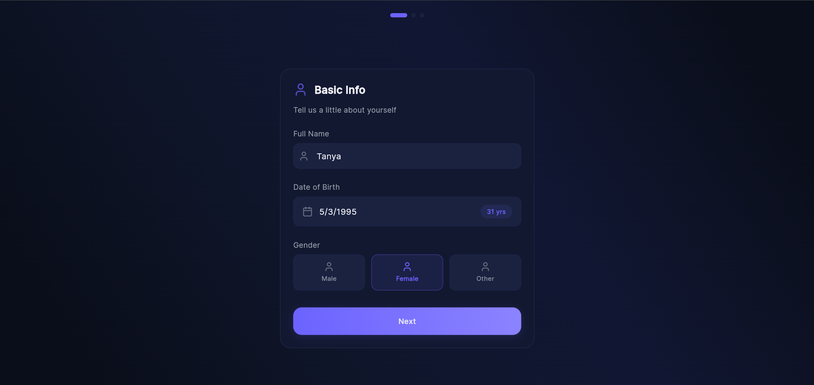

### Profile Selection
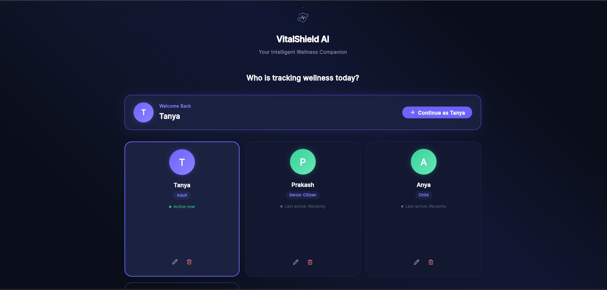

### Health Overview
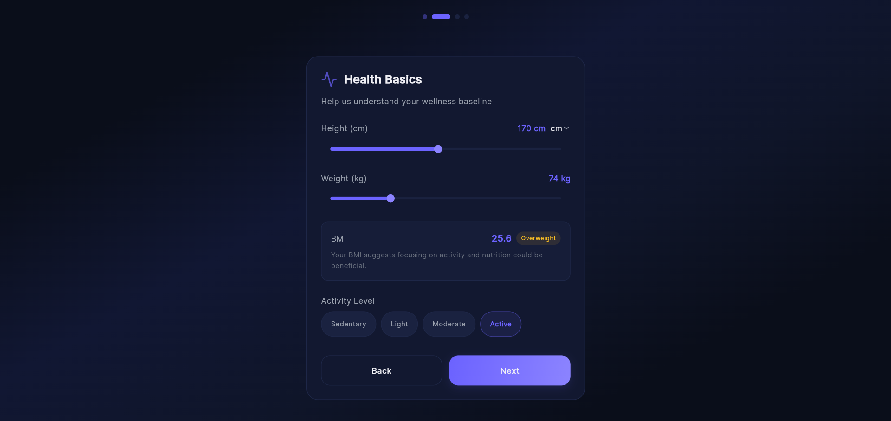

### Predictions
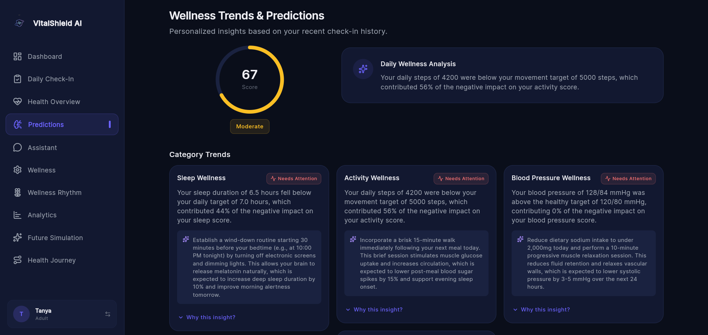

### Wellness Assistant
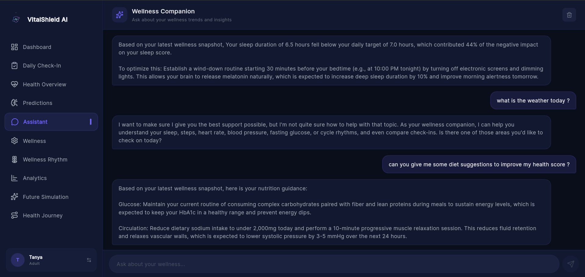

### Wellness Preferences
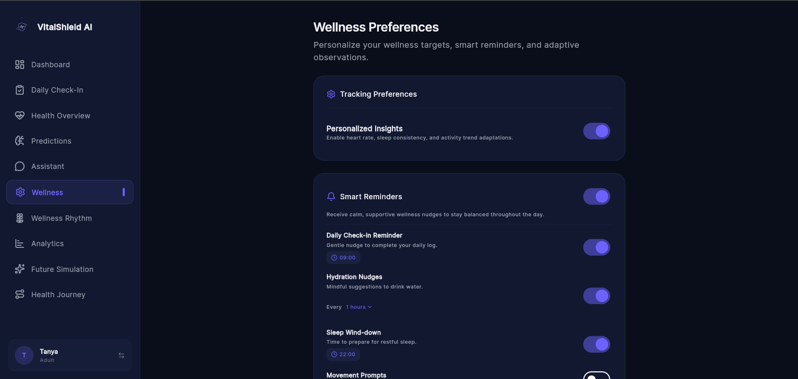

### Future Simulation
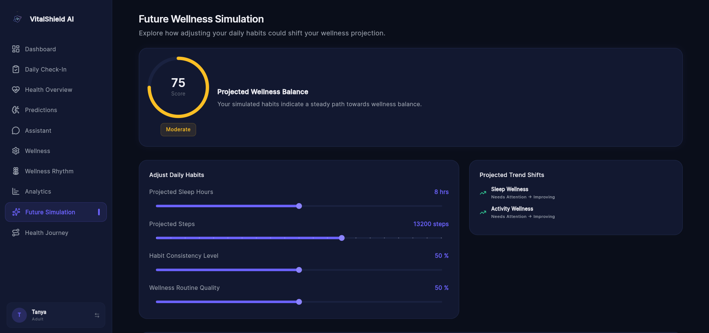

### Analytics
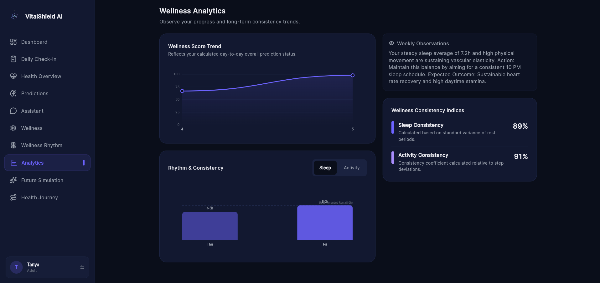

### Health Journey
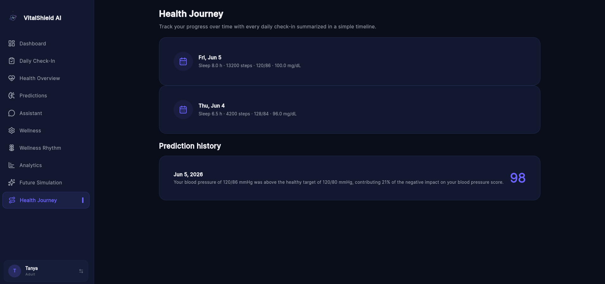


## Architecture

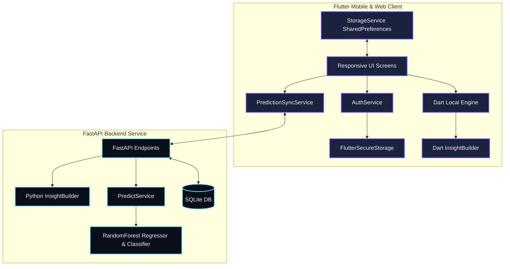

---

## Technology Stack

* **Frontend Framework**: Flutter (Dart)
  - *State Management*: Riverpod
  - *Routing*: GoRouter (Declarative, URL-aware routing)
  - *UI Package*: Lucide Icons, Google Fonts (Inter)
* **Backend Framework**: FastAPI (Python)
  - *Server*: Uvicorn
  - *ORM*: SQLAlchemy
  - *Security*: Passlib (PBKDF2 Password Hashing), JWT-inspired HMAC-SHA256 tokens
* **Machine Learning**: Scikit-Learn
  - *Models*: RandomForestRegressor, RandomForestClassifier
  - *Data Manipulation*: Pandas, NumPy
* **Local Persistence**: `SharedPreferences` (Profiles, metrics), `FlutterSecureStorage` (Tokens)
* **Database**: SQLite (Highly portable, development-ready)
* **Containerization**: Docker, Docker Compose

---

## Machine Learning Pipeline

### 1. Training Dataset Generation & Physiology Correlations
The training dataset is generated synthetically (5,600 samples) inside `model_trainer.py`. Unlike naive random generators, it simulates true physiological relationships:
* **SBP-DBP Coupling**: Enforces diastolic blood pressure based on systolic:
  $$\text{DBP} = 0.5 \times \text{SBP} + 17.5 + \mathcal{N}(0, 5) \quad \text{s.t.} \quad \text{SBP} \ge \text{DBP} + 20$$
* **Poor Sleep to resting heart rate (RHR)**: Sleep $< 6\text{h}$ increases RHR by $4\text{--}10\text{ BPM}$.
* **Activity to RHR**: Steps $\ge 12,000$ reduce RHR by $5\text{--}12\text{ BPM}$; steps $\le 3,000$ increase RHR by $2\text{--}6\text{ BPM}$.
* **Elevated BP to RHR**: SBP $> 130$ mmHg increases RHR by $3\text{--}8\text{ BPM}$.
* **Emergency Augmentation**: Includes $600$ guaranteed hypertensive crisis, severe hypoglycemia, and hyperglycemia profiles.

### 2. Clinical Safety Overrides
Because standard ML classifiers cannot extrapolate out-of-distribution values, hard caps are applied:
* If SBP $\ge 180$, DBP $\ge 120$, Glucose $< 55$, or Glucose $> 300$, the labeling function overrides the regression score to $40$ and sets the classification category to `Critical`.
* This ensures that the ML models train on capped values and that the rule-based safety barrier is preserved in production.

---

## Security Features

1. **Secure Token Storage**: Encrypts JWT tokens on mobile Keystore (Android) and Keychain (iOS) using `FlutterSecureStorage`.
2. **Namespaced Data Caching**: Health data in `SharedPreferences` is keyspace-partitioned using the active profile ID prefix (`profile_{id}_`), preventing data leaks between profiles.
3. **Password Hashing**: Backend password strings are salted and hashed using `PBKDF2-SHA256` via `passlib`.
4. **Secret Key Offloading**: Relies on environment variable configuration (`SECRET_KEY`), with a fallback default restricted to development environments.

---

## Offline Architecture

```
[Local Check-In Saved] ──> [Connectivity Failed?] ──> [Save to Namespaced Cache]
                                                               │
                                                       (Internet Restored)
                                                               │
                                                               ▼
                                               [Upload Snapshot & Merge Hashes]
```
* **Offline Calculation**: When the client detects an offline state, the local Dart engine performs identical scoring estimates.
* **Sync Mechanism**: Uses `PredictionSyncService` to query pending offline data points, serializes them, hashes the metric vectors (to prevent double uploads), and syncs them back to the SQLite DB when connectivity is restored.

---

## AI Assistant

* **Context Construction**: The assistant builds user prompt context by serializing the latest wellness score, the **Highest Impact Opportunity**, and current vital sign values into the query context.
* **Wording Alignment**: The assistant is constrained to explain sub-optimal metrics using the exact text formulated by the `InsightBuilder`, preventing hallucinations.
* **Emergency Interception**: The assistant intercepts exercise or workout optimization queries if the user has an active `Critical` category, returning a safety warning.

---

## Folder Structure

```
vitalshield_ai/
│
├── backend/                             # Python FastAPI Backend
│   ├── database/                        # Database models & connections
│   │   ├── db.py                        # SQLite engine setup
│   │   └── models.py                    # SQLAlchemy User/Profile/Checkin models
│   ├── models/                          # Trained RandomForest serialized jobs
│   ├── schemas/                         # Pydantic schemas (validation)
│   ├── services/                        # Business logic
│   │   ├── predict_service.py           # ML prediction, safety overrides
│   │   ├── analytics_service.py         # Step consistency calculations
│   │   └── insight_builder.py           # Centralized Python insight generator
│   ├── tests/                           # Pytest validation test suites
│   ├── main.py                          # Main API router & controller
│   └── model_trainer.py                 # Synthetic data & RF training script
│
├── lib/                                 # Flutter Frontend codebase
│   ├── core/                            # Shared core configurations
│   │   ├── constants/                   # String/image constants
│   │   ├── theme/                       # Design system (colors, spacings)
│   │   └── router/                      # GoRouter config
│   ├── features/                        # Feature-specific packages
│   │   ├── auth/                        # Login & SignUp modules
│   │   ├── checkin/                     # Vitals logging widgets
│   │   ├── dashboard/                   # Core metric scores, providers
│   │   ├── predictions/                 # Predictions UI & Dart InsightBuilder
│   │   └── assistant/                   # Wellness Chatbot UI & logic
│   ├── models/                          # User/Check-in models
│   ├── navigation/                      # Sidebar & BottomNav with "More" drawer
│   └── services/                        # Secure Storage, API, and Sync services
│
└── test/                                # Widget and unit test suites
```

---

## Installation

### 1. Backend Server Setup
Ensure Python 3.10+ is installed:
```bash
cd backend

# Create virtual environment
python -m venv .venv
source .venv/bin/activate  # On Windows: .venv\Scripts\activate

# Install requirements
pip install -r requirements.txt

# Run ML training and seed DB
python model_trainer.py
python seed_demo_data.py

# Launch FastAPI development server
uvicorn main:app --reload --host 0.0.0.0 --port 8000
```
*Note: API documentation is auto-generated and viewable at `http://localhost:8000/docs`.*

### 2. Flutter Mobile & Web Setup
Ensure the Flutter SDK is installed:
```bash
# Get dependencies
flutter pub get

# Run on available Chrome web server or connected emulator
flutter run
```
*Note: If running on Android Emulator, API calls are automatically routed to `10.0.2.2` (loopback alias to host machine).*

---

## Testing

Run the test suites to verify functionality:
* **Backend Pytest**:
  ```bash
  cd backend
  pytest tests/
  ```
* **Frontend Flutter Tests**:
  ```bash
  flutter test
  ```

---

## Future Scope

1. **Wearable SDK Integration**: Direct integration with Apple HealthKit and Google Health Connect to pull vitals automatically instead of relying on manual check-ins.
2. **Advanced Neural Networks**: Transitioning the Regressor engine from RandomForests to deep neural networks for multi-variate time-series forecasting.
3. **Multi-Region Scale**: Upgrading the database layer from SQLite to PostgreSQL and deploying the API services on AWS ECS/Kubernetes.
